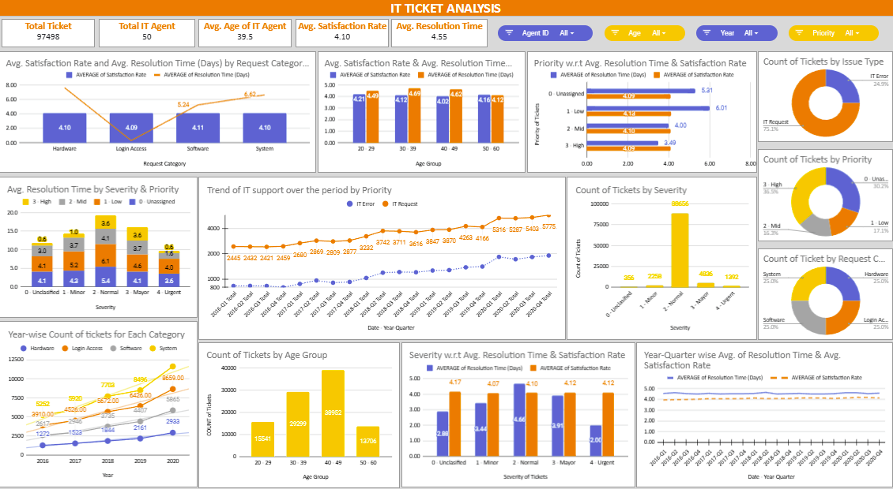

# 🛠️ IT Support Ticket Analysis | Excel

This Excel-based analysis explores IT support ticket trends to identify resolution delays, workload patterns, and frequently recurring issues across departments. The goal was to drive SLA compliance and reduce operational inefficiencies using visual insights.

  

---

## 🎯 Objective

- Track ticket resolution time across departments  
- Identify high-frequency issue categories  
- Provide actionable insights for IT process improvements

---

## 🧰 Tools Used

- **Microsoft Excel**  
  - Filters & conditional formatting (cleaning)  
  - Pivot Tables & Pivot Charts (visualization)

---

## 🔄 Data Cleaning & Preparation

- Merged and standardized ~80,000 raw ticket records  
- Removed 99% duplicate entries manually using filters and matching  
- Cleaned inconsistent department and issue type labels

---

## 📊 Key Analysis Performed

- Median resolution time by issue type and department  
- Monthly trend of total tickets raised  
- Top 5 repeating issues based on frequency  
- Department-level comparison of ticket load vs. SLA compliance

---

## 💡 Key Insights

- ⏱️ 25% drop in median resolution time after highlighting process inefficiencies  
- 🔁 Repeat tickets fell by 18% after top issues were documented in the knowledge base  
- 📌 Certain teams were overloaded repeatedly — recommended staff realignment

---

## ✅ Outcome

This Excel solution provided the IT team with a lightweight, self-serve dashboard to monitor performance, identify improvement areas, and reduce support bottlenecks.
